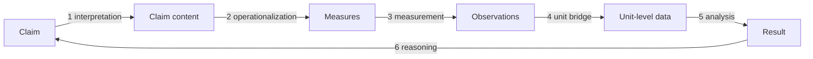

# Claim-Evidence Alignment (CEA)

Claim-Evidence Alignment (CEA) is a framework for assessing whether the evidence in a paper and its published research artifact supports the paper's claims. For each claim, CEA reconstructs the chain that connects the claim to its evidence, then compares what the claim asserts with what the chain shows.

A claim can have a complete chain and still lack support, because the chain only shows how the claim connects to the evidence. A separate alignment assessment decides whether the evidence supports the claim. A gap in the chain is recorded as a finding and is never filled with assumptions.

This document is the whole framework. Section 1 gives the rules for selecting claims, which is the step that reads the paper and writes the claim record, and Sections 2 to 7 give the steps that reconstruct and assess the chain. Section 1 is the reference that the `extract-claims` skill applies, and the rest states what the later steps do with what it records, so that a number in a record is read the way the framework means it.

## Scope

CEA covers narrow quantitative empirical claims, as defined in Section 1. Its sources are the published paper and the published research artifact, and claim selection reads only the paper.  An agent drafts the selection of claims, each chain, and each alignment assessment, and a person, the checker, reviews them.

The checker can recount a count that comes from qualitative coding in the coded data, and the coding procedure belongs to that count's chain. Where every finding the paper puts forward is qualitative, no main result depends on such a count, so it is an excluded claim candidate whose reason says that, where no other ground fits. For a statement without a number, Section 1's rules for frequency words decide.

CEA works at the conceptual level and does not define how to find chain elements in concrete papers and artifacts. It also excludes these topics:

- qualitative claims, such as themes or codes derived from interviews or discourse
- formal claims, such as proofs or properties of an algorithm
- novelty claims, such as "the first study of X"
- causal graphs and theory building
- sub-chains, which split a single link into finer steps
- representation formats
- comparisons across papers

## Glossary

Every term the framework uses, defined once. The sections that follow use these terms and do not
define them again. Where a term names one of a fixed set, the section that holds the set is named
rather than its members repeated here.

| Term | Id | Meaning |
|---|---|---|
| Research artifact | | What the paper published beside itself for others to check or reuse: the data, the code, the materials, and their documentation, wherever the paper says they are. Where a paper published none, every link that needs it is a gap for want of access. |
| Quantitative | | Of a statement: the paper bases it on counting or measuring the study's own data, so that it gives an amount, a share, a ranking, a difference, or a trend. Counts and rankings from qualitative coding are quantitative in this sense. |
| Checker | | The person who reviews what an agent drafts, and who can overturn any of it. |
| Main result | `R` | A finding that the paper's results, discussion, and conclusions put forward as what the study shows. Section 1 gives its four kinds. |
| Claim | `C` | A specific statement of a quantitative result in the paper's text, which includes figure and table captions and footnotes. A number that appears only inside a table or a figure is evidence for a claim, not a claim. |
| Claim candidate | | A statement that could be a claim until the selection question decides. |
| Excluded claim candidate | `E` | A claim candidate that the selection question excluded, recorded with the ground that excludes it. |
| Selection question | | The one question that decides whether a claim candidate is a claim: would a main result fail or need substantial revision if the statement were false or unsupported? Section 1 states it and says how to answer it. |
| Ground | | The reason a claim candidate is out of scope, which excludes it without the selection question being reached. Section 1 lists the grounds. |
| Summary sentence | | A sentence in the abstract, the contribution list, a boxed answer, or the conclusion, or one in the introduction that gives the study's findings. |
| Boxed answer | | A passage the paper labels as the answer, summary, or finding for a research question, such as "Answer to RQ1:", whether or not it is printed in a box. |
| Item | | One of the things that a main result names and counts or measures on its own, such as a task category, a file type, or a tool. |
| Detail | | A sentence that gives numbers for a subset of an item, for a single example, or for a pattern, subgroup, or category that the main result does not name. |
| Part | | One of the statements that a split sentence becomes, each needing different evidence. Section 1 says when to split. |
| Chain | | The six links from a claim through its evidence and back to the claim. Section 2 gives them. |
| Link | | One of the chain's six steps. Section 2 names and numbers them. |
| Element | | What a link runs to: the claim content, the measures, the observations, the unit-level data, and the result. Section 2 defines each. |
| Construct | | A concept that the claim asserts something about, such as seniority, coding time, or throughput. Some measures represent their construct directly, others only indirectly. |
| Unit of observation | | The kind of entity that each record in the data describes, such as a commit, a post, or a survey response. |
| Unit of analysis | | The kind of entity the claim is about, such as a developer, a repository, or a project. It and the unit of observation are often different, which is why link 4 exists. |
| Claim kind | | Descriptive, associational, predictive, or causal. |
| Link quality | | How far a link is established: clear, speculative, or a gap. Section 3 defines the three. |
| Basis | | What a link's quality rests on, which makes the judgement open to inspection. Section 3 says what it holds for each quality. |
| Mapping level | `L` | How far along the chain the reconstruction got before it stopped, L1 to L4. Section 4 gives the levels. |
| Alignment assessment | | The comparison of what the claim asserts with what the chain shows. Section 5 gives the mismatches it looks for and the verdicts it ends in. |

## 1. Claim selection

Claim selection reads the paper and writes the claim record. It decides three things: which of the paper's statements state its main results, which specific statements are the claims that those results rest on, and which statements a checker could expect to be claims but that were not selected. Statements in the abstract or the contribution list are usually broader than a claim. CEA does not reconstruct chains for them directly but uses them to find the claims that they depend on.

### The selection record

A checker reviews the selection itself, not only its outcome, so the record holds three kinds of entry:

| Entry | Id | What it holds |
|---|---|---|
| **Main result** | `R1`, `R2`, ... | One of the paper's main results, quoted from the sentence that states it, with every other place the paper states it again. |
| **Claim** | `C1`, `C2`, ... | One claim, quoted with its location, the main results it serves, and how each of them would fail if the claim were false. |
| **Excluded claim candidate** | `E1`, `E2`, ... | One statement that a checker could expect to be a claim and that was not selected, with the ground that excludes it. |

Recording what was set aside, and why, is what makes the selection reviewable: a checker can overturn any of the three.

An id is the permanent name of its entry and the anchor a reader links to, so a later change never renumbers one: a new entry takes the next free number even where that puts it out of order.

A main result that the paper states as a qualitative finding is out of scope, so the record holds no claim for it. A main result that no claim serves stays in the record as a finding, with the reason the paper's own evidence does not reach it.

The subsections below give the rules that decide each of the three, and `record-format.md`, beside this file, gives the fields that hold them.

### Main results

A main result or key contribution is a finding that the paper's results, discussion, and conclusions put forward as what the study shows. List the main results before judging any candidate. They are of four kinds:

1. a finding that a boxed answer gives to its research question
2. a finding that the abstract, the contribution list, or the conclusion states
3. a finding presented in the results or the discussion as a main, key, central, principal, or most important finding or contribution, when no sentence of the kinds above states it
4. a tool, model, or framework that the paper presents as a contribution and evaluates

A list of findings in the introduction counts as the contribution list.

The same finding in several places is one main result. The following are not main results, even when a summary states them or they give a number:

- a breakdown of a main result: a subgroup, an exception, an example, or the pattern of a subset
- a recommendation, an implication, or a design lesson. The finding that it rests on is a candidate, and the selection question for that candidate names one of the other main results.
- a sentence in the results or the discussion that only repeats a candidate's own number or ranking. The rules for boxed answers under "Recording a main result" decide about a sentence in a boxed answer.
- a statement that the paper mentions once and does not build on
- a finding that the discussion only highlights, calls notable, or bases a recommendation on

### Recording a main result

Record each main result once, quoting the sentence that states it. A sentence that states more than one main result is one entry all the same, and its `note` names each main result that it states. When several sentences state the same main result, quote the sentence that comes first in this order: the boxed answer, the abstract, the contribution list, the conclusion. Where a sentence later in the order states the result more specifically, quote that one instead. The order runs over the sentences that qualify as main results, so it passes over one that gives no quantitative part, in numbers or in words. Where several sentences present the same tool, model, or framework, which needs no quantitative part, quote the one that says how well it performs, whatever its place in the order, because the claims for its performance attach to that wording. Record each other sentence that repeats it as an excluded claim candidate, with `duplicate_of` naming the main result. A sentence that repeats one main result and also states a main result that no earlier source states is the entry for the main result that no earlier source states, and its `note` names the main result that already states the repeated main result. Its claims are those of the main result it is recorded for; the claims of the repeated one stay with the statement that states it. What it adds is a main result of its own only where it reports something that no main result mentions, or measures a different outcome. A main result mentions what its sentence names, not what a table groups under that name. Where the only sentence with a number gives the category that holds what the main result names, that sentence is the claim candidate, and its `note` gives the table's breakdown. Where its only addition is a subgroup, an exception, an example, or the pattern of a subset of something a main result mentions, it reports nothing new and breaks that result down. Record it as an excluded claim candidate whose `reason` says which part it adds, with `breaks_down` naming the main result it divides; `breaks_down` names main results only.

Use a sentence from the results or the discussion only for a main result of kind 3 in the list above, with `source` `other` and a `note` that says why no summary sentence states it. A main result needs a quantitative part, in numbers or in words, unless it presents a tool, model, or framework and the paper evaluates how well it performs.

Other summary sentences are not main results:

- A purely qualitative summary, such as a taxonomy described in the abstract, is left out.
- A summary sentence that gives at least one number, where every number describes the study, such as the size of the corpus, is an excluded claim candidate, with one entry per sentence that covers all of its numbers. The rule also holds when the sentence combines such numbers with a qualitative finding. A summary sentence without numbers is left out, unless it repeats or breaks down a main result, which the paragraph above covers. A sentence that also states a quantitative main result, in numbers or in words, is a main result entry instead, and its numbers that describe the study are recorded from the method sentence that states them, unless a summary sentence that is already an excluded claim candidate states them.
- A contribution that only announces an analysis, such as "we analyze how the tools are configured", is left out.

Judge a boxed answer sentence by sentence:

- Each sentence that gives a finding in answer to the research question is one main result with `source` `rq_answer`, unless the rules above have already settled it. A box sentence whose every number describes the study, or that states no quantitative result at all, is an excluded claim candidate or is left out, exactly as the same sentence would be anywhere else. Standing in a box does not make a sentence a main result. The source is `rq_answer` wherever the box stands, including inside a results section, because the source says which kind of sentence states the main result, not which section prints it. A box can give several findings, such as one about tasks and one about file types, and a single sentence of the box can state more than one. A sentence adding a breakdown, subgroup, or exception of a finding in the same box is not a main result. Record it as a breakdown, naming the main result for that finding, or, where that finding is itself an excluded claim candidate, naming that candidate in the `reason`.
- A number in the box is backed by the most specific sentence that states it. If a sentence in the results or the discussion states it more specifically, that sentence is the claim candidate.
- When a box sentence needs the sentence before it as context, for example because it starts with "However" or refers to "them", quote the two sentences together in whatever record the second sentence gets. If the sentence before it states a finding of its own, that earlier sentence keeps its own record as well. If the second sentence gets no record of its own, leave the pair out and keep the record of the sentence before it.

A main result's own sentence can be the only sentence in the paper's text that gives its number, for example when the results give that number only in a table. Record such a sentence both as the main result and as a claim with the same quote that serves it, whatever its source. Where a sentence in the results or the discussion states the number more specifically, that sentence is the claim instead, as the rule for a number in a box says above.

A paper can have no main results recorded, when every finding it puts forward is qualitative. Record the excluded claim candidates, record no claims, and say so in the report.

Main results help to find claims. Supporting a main result does not make a statement a claim, because the selection question decides. A main result that no claim serves needs a `note` that says why, for example that the paper gives no result for it. A main result that the paper states but never measures is recorded all the same, not a repetition of the result it is stated beside, because the record has to show that the paper puts it forward. How the paper frames it decides whether it states it: a sentence giving it as what the study found or shows is the paper's own, however ordinary the remark, while the same words in the introduction or in related work are background and are left out. Its `note` says that the paper gives no result for it, and names what the paper does measure instead.

### Claims and excluded claim candidates

A result is often stated several times. A sentence states it more specifically than another only if it covers the same items, measures, and subgroups and gives the numbers. When a main result names several items, such as three kinds of task, and the results give each item's number in its own sentence, those sentences together are its most specific wording, and each of those sentences is a claim candidate. A sentence that gives the number for one of the items that the main result names is a claim candidate, even where the numbers of the other items stand in a table or in no sentence at all.

Ask the selection question for a detail as for any other candidate. A detail almost always fails it.

If you are unsure whether a candidate passes the selection question, record it as an excluded claim candidate and begin its `reason` with the word "Unsure". Name in `note` the main result that might depend on it, and the passages that support each choice, so that the checker can change it into a claim.

### Frequency words without a number

Words such as "dominant", "most", "often", "widely", and "growing", and words of prominence such as "important", "notable", and "key", do not decide by themselves whether a statement is quantitative. What the paper bases the word on decides:

1. A statement that reports cited or background work is not a claim of this paper. Leave it out, except as described under "Results and descriptions of the study".
2. If the paper bases the word on counts or measurements, such as a number nearby, a table or figure of counts, or a statistical test, the statement is quantitative. If the paper bases the word on the authors' reading of quotes or examples, the statement is qualitative. Leave it out. If you cannot tell, record an excluded claim candidate and say in `note` what is unclear.
3. If the paper says that it does not quantify prevalence, for example that its approach captures the range of views but does not measure how common each view is, leave out every statement that gives a frequency only in words. The rule holds even when the paper counts codes elsewhere, including the code that the word describes. The rule also holds when the same sentence adds that the frequencies do not generalize, and when the word rests on an analysis such as co-occurrence. The "cannot tell" case of rule 2 does not apply. A sentence that only says that the frequencies do not generalize is a limit of scope and does not trigger this rule. Neither does a sentence saying what the measured frequencies may reflect, such as what developers disclose rather than what they do: the paper measured them, and the rule turns on a paper that declines to. A sentence that gives a count from the coding stays a quantitative candidate, even when it also states a rank in words. Only a sentence without a count of its own is left out. Where this rule removes any statement, record one excluded claim candidate quoting the paper's own sentence that declines to quantify, with a `reason` saying that it is the ground on which those statements were left out and a `note` naming two or three of them. Without it the page is silent about a decision that removed sentences a checker would look for, and the report in chat does not outlive the session.
4. A quantitative statement without a number in the abstract, the contribution list, a boxed answer, or the conclusion is a main result if it states one. Otherwise leave it out. Its claim candidates are the sentences in the results or the discussion that state the same result more specifically, which are the sentences that give the counts or measurements that the frequency word rests on. If no sentence in the results or the discussion gives any of them, the vague sentence in the results or the discussion is the candidate, as in rule 5. Where the results and the discussion state the result nowhere, the main result has no claim, and its `note` says so. If there is no candidate, the main result's `note` says so.
5. For a quantitative statement without a number in the results or the discussion, look for a sentence that states the same result more specifically, as defined above. Each sentence that gives the number for one of the items that the vague sentence names is a claim candidate, and the vague sentence is a repetition, unless every such sentence fails the selection question, which the last case of this rule covers. Where no sentence gives a number for any of those items, the vague sentence stays the claim candidate, and `note` then says whether the numbers are in a table, in a figure, or printed nowhere. Where one item's number stands only in a table, the sentences that do give numbers are the claims, and `note` names the table for the remaining item. Where every sentence that gives a number fails the selection question, for example because it gives the number for a single example or a single tool, the vague sentence stays the claim candidate. Its `note` names the table, the figure, or the sentence where each number stands.

### Selection question

Select a claim if the answer to this question is yes:

> If this statement were false or unsupported, would a main result or key contribution fail or need substantial revision?

"False" means that what the candidate asserts does not hold in the way that the main result uses it, because its direction, ordering, comparison, or threshold reverses or disappears. A somewhat different number does not make a candidate false. A count of none makes a candidate false only when the main result says that something occurs or recurs, such as "developers repeatedly revert generated code". A reason stating that a different number would change a count, a breakdown, or a sentence that repeats the number does not show that a main result fails.

Name the main result and say how it would fail or need substantial revision. Imagine only this statement false, and leave the paper's other results standing. If the main result would still stand, the candidate is an excluded claim candidate, and its reason names that main result by its id. A candidate that the question never reaches, because it is out of scope, names the ground that excludes it instead. Where more than one ground fits, the `reason` names the one that decides and the `note` says what else stands against the sentence. The grounds are:

- its numbers describe the study
- it repeats another entry
- it reports cited work, or a number that a participant states
- it is the accuracy of a model that the paper only reads other findings from
- no main result states the main result that it would serve
- another ground that this section gives

A candidate that the question does reach names a main result id, whichever way it is answered. Where the record has no main result, every finding the paper puts forward is qualitative and no id exists to name. Every candidate then meets the ground that no main result is recorded for the finding it would serve, so that ground says nothing: name the ground that excludes the candidate on its own terms. Where no other ground fits, the reason says that every finding the paper puts forward is qualitative, so none of them rests on a count from the coding. Examples of details that fail are a rank below the ranks that the main result names, a count for a pattern that the main result does not name, the rate of a single tool when the main result compares groups of tools, and a remark that a robustness check changed nothing.

When the paper bases a main result on several results together, select each result that the summary, the discussion, or the conclusion names as a basis, unless it is the count for one pattern, subgroup, or category of another result that this record selects as well. Where two results stand in that relation, select the result that covers the whole sample and record the other as an excluded claim candidate. Do not reject a result because another result would carry the main result alone. Taken on its own, each of these results would fail the selection question, since the main result stands without any one of them. This rule overrides that outcome. A main result about variation, such as "results vary widely across projects", rests on the result that shows the variation as a whole, not on the count for each pattern.

### Splitting

Split a statement when its parts need different evidence, meaning a different measure, dataset, subgroup, or analysis, so that one part could be false while the other holds. For example, "X is faster and uses less memory" has two parts. Do not split the two sides of one comparison, difference, or ranking, because the comparison is one part. Do not split parts that measure one finding in several ways either, such as the share of repositories, of pull requests, and of comments for one concentration: the main result rests on them together, and each part alone would leave it standing. A sentence that gives counts for several categories is split when the main result names only some of them: the counts for the named categories are one part, and the counts for the unnamed categories are an excluded part. This rule decides such a sentence, whether or not the named categories rest on different subgroups of the data. Splitting along named and unnamed categories is not splitting a comparison. A part that states a negated finding keeps the negation with the word that it negates. The negation words are not (except in "not only"), no, never, neither, nor, none, without, cannot, and a word ending in "n't". A clause that is out of scope, such as a qualitative finding, is not a part and is not recorded, so its negation is not kept. `cea_claims.py validate`, the script that checks the record against the paper's text, warns when no part keeps a negation of the quote, and when a negation is separated from its word. Ask the selection question for each part. A part that passes is a claim, and a part that fails is an excluded claim candidate with the same quote, its own `states`, and the shared `split_from`.

### Results and descriptions of the study

Numbers that describe how the study was done are excluded claim candidates, not claims, even though they are quantitative. Examples are sample sizes, corpus sizes, the number of codes in a codebook, inter-rater agreement, and the shape of the codebook, such as the number of clusters it is organized into, even where an algorithm rather than the authors produced them. An agreement score that only supports the coding procedure describes the study. A number that says how much material the study retrieved, sampled, annotated, or coded describes the study, wherever it stands and including in a boxed answer. Such a number is a result only where the paper compares it across groups or over time, or relates it to something else. Every summary sentence that is an excluded claim candidate under "Main results" gets its own entry. The same size can therefore appear in several. Record a size of the study once more where no such sentence states it, quoting the sentence outside the summaries that does, usually in the method section. Record that sentence as well where it gives the size in more detail than any summary sentence does, such as a split into kinds, because the checker looks it up there. More detail means more numbers or a split of the number, not a fuller account of how it was arrived at. Record the sizes of the material the results rest on, such as the documents, posts, participants, or repositories analyzed, and the size of the codebook. Only these numbers from a step of the coding procedure are left out: a count of revisions, of review rounds, of changed labels, and a count of codes that a later step replaced. An agreement score is recorded, as above. Where a summary sentence that is itself an excluded claim candidate states one of those numbers, the method sentence gets no entry of its own. A method sentence can give both a size to record and a number that is left out. It is recorded once, for the size. Where the summary sentence also gives a size that is already recorded, record it anyway, because one entry covers all the numbers of its sentence.

A model's accuracy is an excluded claim candidate when the paper only reads other findings from the model, such as feature importances or labels. It is a claim candidate when the paper presents the model as a contribution, or when a research question asks how well the outcome can be predicted. Where one model has several accuracy figures, select the figures that the main result's wording rests on, not figures per class, per subset, or for models that the paper compared only incidentally. Where the setup that the study used still leaves several, select the figure for the outcome that the later analysis rests on. Where figures for that outcome differ only in what they are measured on, such as an annotated sample and the whole dataset that the later analysis labels, and the main result's wording does not separate them, each is a claim. Each `note` then says what its figure is measured on, because the checker needs both to follow the chain. Record the remaining figures as excluded claim candidates whose reason names the main result that still stands and the selected figures, as in "R2 would still stand; C3 is the figure the later analysis rests on".

A number that a participant states, such as "30 PRs per day" in a quoted post, and a result of cited work are not results of this study. Record them as excluded claim candidates only where the paper sets them beside its own results, as in a comparison with prior work in the discussion. Otherwise leave them out.

### What claim selection does not decide

The next step interprets each claim, which means establishing the claim content that Section 2 defines. Sections 2 to 5 reconstruct the chain to the evidence and assess whether the evidence supports the claim. None of those interpretations and assessments belongs in the claim record. Every claim in a record that claim selection has written stands at mapping level L1, which Section 4 defines: the claim, with its exact wording, location, and selection reason, and no link of the chain reconstructed.

## 2. The chain

The chain runs from a claim through its evidence and back to the claim.

### Elements

| Element | Meaning |
|---|---|
| Claim | The claim at the start of the chain. |
| Claim content | The constructs and their relation, the unit of analysis, the scope, and the claim kind. The scope covers the entities, settings, and period that the claim refers to. |
| Measures | What represents each construct in a form that can be observed. |
| Observations | The recorded data, which describes entities at the unit of observation. |
| Unit-level data | Observations brought to the unit of analysis. |
| Result | What the analysis of the unit-level data shows. This is not the paper's **main result** in the sense of Section 1: a main result is what the paper puts forward as its finding, and a result here is one outcome of one analysis that a claim rests on. |

The less directly a measure represents its construct, the more justification the reasoning link needs.

### Links

| # | Link | Question the link answers |
|---|---|---|
| 1 | Interpretation | What does the claim assert, about which entities, and within which scope? |
| 2 | Operationalization | Which measure represents each construct? |
| 3 | Measurement | Which observations carry each measure? |
| 4 | Unit bridge | How do observations about one kind of entity become data about the unit of analysis? |
| 5 | Analysis | How does the analysis produce the result? |
| 6 | Reasoning | Why does each measure represent its construct, why does the result bear on the claim, and which assumptions and objections apply? For a causal claim, the reasoning includes the causal assumptions. |

The unit bridge is a separate link because a claim and its data can concern different units. A claim about developers that rests on data about commits needs this bridge, and aggregating commits to developers can change the relation that a result shows [8]. When the observations already describe the unit of analysis, the unit bridge needs no further step.

A claim can rest on several results in this sense, each with its own chain. When the claim needs the results jointly, every chain is reconstructed. When one result alone supports the claim, reconstructing its chain is enough, and the record for the claim, described in Section 7, states why.

## 3. Link quality

Each link has one of these qualities:

| Quality | Meaning |
|---|---|
| Clear | A checker can confirm the link from the paper or the artifact without adding assumptions. |
| Speculative | The link is plausible but depends on an added assumption. |
| Gap | No link was found, or the material needed is not accessible. |

Only clear links count toward the mapping level in Section 4. A clear link counts whether the authors stated it or it was reconstructed from the artifact.

Each link also records its basis:

- For a clear link, the basis says where the link can be confirmed and whether the authors stated it or it was reconstructed.
- For a speculative link, the basis names the assumption that the link depends on.
- For a gap, the basis names what is missing or not accessible.

No rule fixed in advance separates clear from speculative links for every claim, because the judgment depends on the field, the data, and what the checker knows. The basis makes each judgment open to inspection. The checker accepts or overturns each drafted link quality using its basis, and borderline links found during checking are collected as examples. Over time, these examples show how checkers distinguish clear from speculative links in practice.

Link quality records whether the link is established. For example, if commit counts are established as the measure of coding time, the operationalization link is clear. The authors' justification for why commit counts represent coding time belongs to the reasoning link, and the alignment assessment in Section 5 judges whether that justification is adequate.

The reasoning link is clear only when the authors made the argument, in the paper or in the artifact. A justification that the agent or the checker supplies is an added assumption, so it is recorded as speculative and does not count. The requirement that the authors made the argument applies in particular to the justification that a measure represents its construct.

## 4. Mapping level

The mapping level is how far along the chain the reconstruction got before it stopped. The chain runs in the order its links are numbered, so each level requires every link below it: a chain reaches an element only when every link from the claim to that element is clear. One gap or speculative link therefore holds the level at the element before it, however many links beyond it are clear.

| Level | The reconstructed chain reaches | Requires |
|---|---|---|
| L1 | The claim alone. | Nothing. Link 1 is not clear. |
| L2 | The claim content. | Link 1. |
| L3 | The result. | Links 1 to 5. |
| L4 | The reasoning. | Links 1 to 6. |

Report the level for each reconstructed chain together with the first link that is not clear, as in "L2, speculative at the operationalization", and with any further link that is not clear. The first such link is what holds the level, so naming it says what the reconstruction would need next. A high level does not indicate strong support: L4 says every link is clear, not that the evidence bears out the claim, which is what Section 5 decides.

Links 2, 3, and 4 give no level of their own. A chain that establishes the measures but not the observations stops at L2, as does one that establishes neither, so the level alone does not say how far into the middle of the chain the reconstruction got. The links and their qualities in the record say that, and the level is the summary.

## 5. Alignment assessment

The alignment assessment compares what the claim asserts with what the chain shows, and looks for these mismatches:

| Mismatch | Meaning |
|---|---|
| Construct | A measure represents a different construct than the claim names. |
| Unit | The result concerns a different unit than the claim. |
| Scope | The observations cover fewer entities, fewer settings, or a shorter period than the claim. |
| Relation | The result shows a weaker, different, or opposite relation. |
| Claim kind | The claim is stronger in kind than the evidence, such as a causal claim resting on a descriptive comparison. |

The assessment ends in one verdict:

| Verdict | Meaning |
|---|---|
| Supports the claim as stated | No mismatch was found. The verdict names the limits of the support. |
| Supports a narrower claim | A mismatch exists, and the chain supports a narrower wording, which the verdict states. |
| Insufficient support | A link needed for the comparison is speculative or a gap, or the result does not establish the relation. |
| Conflicting evidence | The result contradicts the claim. |
| Not assessable | Material needed for the comparison is not accessible. |

Each verdict is about one claim. Section 1 selected the claim because a main result would fail or need substantial revision without it, and recorded which main results it serves and how each of them would fail, so the assessment ends by saying what the verdict leaves of each one. A claim that supports only a narrower wording carries its main result no further than that wording reaches. A main result whose claims are all insufficiently supported stands on nothing the chain shows, which is itself the finding.

A verdict rests on the reconstructed chain, and the authors' statement that their evidence supports the claim is not enough on its own. Missing access does not show that the evidence contradicts the claim. A successful run of the analysis does not show that a measure represents the intended construct.

## 6. Example

The example uses a hypothetical claim, "In the studied projects, senior developers spent less time coding than junior developers."

| Link | Chain | Quality and basis |
|---|---|---|
| 1 Interpretation | The constructs are seniority and coding time, the unit is the developer, the scope is the studied projects, and the claim is descriptive. | Clear, stated in the paper |
| 2 Operationalization | Seniority is measured as project tenure, and coding time as commit counts. | Clear, reconstructed from the artifact |
| 3 Measurement | Commit records come from the projects' version histories. | Clear, stated in the paper |
| 4 Unit bridge | Commits are attributed to developers by author identity. | Clear, reconstructed from the artifact |
| 5 Analysis | Commit counts are compared between senior and junior developers. | Clear, stated in the paper |
| 6 Reasoning | Neither the paper nor the artifact argues that commit counts reflect coding time. | Gap, argument absent |

If the artifact did not show how commits are attributed to developers, the unit bridge would be speculative, and its basis would name the assumption that each developer commits under a single identity.

The mapping level is "L3, gap at the reasoning", because links 1 to 5 are clear and link 6 is not. A justification proposed by the checker would be speculative rather than clear, so it would leave the level at L3.

Had the artifact not shown how commits are attributed to developers, the speculative unit bridge would hold the level at L2 even though the analysis link beyond it is clear, and the report would read "L2, speculative at the unit bridge".

The alignment assessment finds two construct mismatches. Commit counts do not represent coding time, and project tenure does not represent seniority in general. The verdict is "supports a narrower claim", with the narrower wording "In the studied projects, developers with longer project tenure made fewer commits than developers with shorter tenure."

## 7. Record for each claim

The selection record of Section 1 already holds each claim with its location, the main results
it serves, and how each of them would fail if the claim were false. The chain steps add to it, per
claim:

- each link of the chain with its quality, its basis, and the outcome of the check
- the reason for stopping when chains are reconstructed for only some of the claim's results
- the mapping level of each reconstructed chain, with its gaps
- the mismatches and the verdict, with reasons
- what the verdict leaves of each main result the claim serves, as Section 5 describes

The two are one record. Section 1's part is written before any evidence is read and is not revised
by the later steps: a claim that turns out to be unsupported was still correctly selected, and the
verdict is what changes, not the selection.

## 8. Foundations

CEA combines established ideas, and its individual concepts are not new. Its proposed contribution is a procedure for reconstructing the chain behind a narrow quantitative claim from a finished paper and artifact, and for judging whether that chain supports the claim. A study still has to show that the procedure is useful, for example by testing whether independent checkers agree on claim selection, link qualities, and verdicts. Micropublications and SEE describe arguments without evaluating them [1, 2]. CEA adds records of gaps and a verdict for each claim.

| Work | Contribution | Use or extension in CEA |
|---|---|---|
| Micropublications [1] | Statements with attribution, data, methods, and challenges, in forms that range from a statement with its attribution to the statement with its complete supporting argument. Support is a single transitive relation | Checks each link separately, so a valid computation does not establish that a measure represents its construct. Adds construct, unit, and scope links for quantitative claims, and alignment verdicts |
| SEE [2] | Scientific claims, their subjects, and consecutive layers of interpretation and attribution, including a curator's evaluation of a report. Premises used jointly, measurement statements represented as assertions, and alternative interpretations that infer a less specific conclusion from the same data. A distinction between a curator's conclusion based on an author's statement and a conclusion inferred from the reported data | Separates links that authors stated from links that others reconstructed. Reconstructs every chain when results are needed jointly, treats a narrower claim like an alternative interpretation, and bases verdicts on the reconstructed chain |
| Nomological networks [3] and measurement in software engineering [4, 5] | A network of laws that relates constructs to each other and to observables [3]. Measurement models that operationalize constructs through indicators [4]. Construct validity as the adequacy of a concept definition and of the indicators that represent it [5] | Applies these ideas to the chain of a single claim |
| Evidence-Centered Design [6] | An approach to designing educational assessments around the inferences to be made, the observations that ground them, and the chain of reasoning that connects them | Applies the same connections to finished research instead of assessment design |
| Estimand framework [7] | A theoretical estimand, defined by a unit-specific quantity and a target population, linked to an empirical estimand under identification assumptions and then learned from data | Works backward, reconstructing what was estimated and comparing it with the claim |
| Simpson's paradox [8] | A practical guide showing that an association in a population can reverse within its subgroups, most likely when inferences cross levels of explanation | Motivates the unit bridge as a separate link |
| Classification of data science tasks [9] | Description, prediction, and counterfactual prediction, which includes causal inference, as distinct classes of tasks | Motivates the claim kind mismatch |
| SciFact [10] | A task and dataset for finding research abstracts with evidence that supports or refutes a scientific claim, with rationales that justify each decision | Ties verdicts to a reconstructed chain and adds a verdict for narrower claims |
| Toulmin's argument model [11] and OntoGSN [12] | What an argument states, how it is qualified and backed, and what may contradict it [11]. Goals supported by strategies and evidence, with context, assumptions, and justifications [12] | Informs the reasoning link |
| PROV [13] and FAIRSCAPE [14] | A data model for the entities, people, and processes involved in producing data [13]. Evidence graphs that the FAIRSCAPE framework creates for each computational result, linking it to the software, computations, and datasets used [14] | Reconstructs the chain after publication and asks whether the results address the claim |

<!--
GROUNDING for the Foundations table. Verbatim quotes from the cited sources.
[1] "The minimal form of a micropublication is a statement with its attribution. The maximal form is a statement with its complete supporting argument, consisting of all relevant evidence, interpretations, discussion and challenges brought forward in support of or opposition to it." / "Micropublications support natural language statements; data; methods and materials specifications; discussion and commentary; challenge and disagreement" / "The supports property is a transitive relation between Representations." / "The determination whether or not a finding is correct, is made over time by the community of the researcher's peers."
[2] "the model of scientific claims, their subjects, their provenance and their argumentative relations" / "It supports representation of arbitrary many consecutive layers of interpretation and attribution and different evaluations of the same data." / "activity of a curator or generally of a third party evaluating a scientific report" / "that (A8) this data item is a measurement of some GS-activity" / "Dashed-dot boxes indicate composite assertions with their component assertions placed inside signifying the has_conjunctive_part relations." / "a third party could assert that g-GHS assays merely achieve the less specific objective of measuring g-glutamyl transferase (GGT) activity" / "In this case the data reported by Tate et al. can still be used to infer that rat liver is a source of GGT-enzyme" / "it is based on the author statement itself and does not necessarily imply an affirmation of how Tate et al. reached their conclusion" / "Representation of curator activity: inference from experimental evidence" / "SEE aims to capture arguments as they are presented in their sources rather than to evaluate their quality or to categorize them."
[3] "A necessary condition for a construct to be scientifically admissible is that it occur in a nomological net, at least some of whose laws involve observables." / "only combined with other constructs in the net to make predictions about observables"
[4] "we need a measurement model in which each latent property is operationalized as the shared variance of multiple indicators"
[5] "construct validity (CV), is defined by how adequate a concept definition is and how well the indicators represent the concept"
[6] "Evidence-centered assessment design (ECD) is an approach to constructing educational assessments in terms of evidentiary arguments." / "the inferences one wants to make, the observations one needs to ground them, the situations that will evoke those observations, and the chain of reasoning that connects them"
[7] "(1) set a theoretical estimand, clearly connecting this quantity to theory, (2) link to an empirical estimand, which is informative about the theoretical estimand under some identification assumptions, and (3) learn from data" / "The unit-specific quantity and target population combine to define the theoretical estimand"
[8] "The direction of an association at the population-level may be reversed within the subgroups comprising that population" / "Simpson's paradox is most likely to occur when inferences are drawn across different levels of explanation"
[9] "three classes of tasks: Description, prediction, and counterfactual prediction (which includes causal inference)"
[10] "select abstracts from the research literature containing evidence that SUPPORTS or REFUTES a given scientific claim, and to identify rationales justifying each decision"
[11] No saved full text. Characterization taken from Clark et al. [1]: "Toulmin's classic model of defeasible reasoning [44], updated by Bart Verheij [45,46], focuses on the internal structure of argument: what the author states, how it is qualified, how the author backs it up, and what other arguments may contradict it."
[12] "the core components of GSN: gsn:Goal, gsn:Strategy, gsn:Assumption, gsn:Justification, as well as gsn:Context and gsn:Solution" / "which goals are fully backed by evidence or which solutions support a given goal"
[13] "PROV defines a core data model for provenance for building representations of the entities, people and processes involved in producing a piece of data or thing in the world."
[14] "The FAIRSCAPE microservices framework creates a complete Evidence Graph for every computational result, including persistent identifiers with metadata, resolvable to the software, computations, and datasets used in the computation"
-->

## References

1. T. Clark, P. N. Ciccarese, and C. A. Goble. Micropublications: a semantic model for claims, evidence, arguments and annotations in biomedical communications. *Journal of Biomedical Semantics* 5:28, 2014. <https://doi.org/10.1186/2041-1480-5-28>
2. C. Bölling, M. Weidlich, and H.-G. Holzhütter. SEE: structured representation of scientific evidence in the biomedical domain using Semantic Web techniques. *Journal of Biomedical Semantics* 5(Suppl 1):S1, 2014. <https://doi.org/10.1186/2041-1480-5-S1-S1>
3. L. J. Cronbach and P. E. Meehl. Construct validity in psychological tests. *Psychological Bulletin* 52(4):281-302, 1955. <https://doi.org/10.1037/h0040957>
4. P. Ralph, M. Kuutila, H. Arif, and B. Ayoola. Teaching Software Metrology: The Science of Measurement for Software Engineering. arXiv:2406.14494, 2024. <https://arxiv.org/abs/2406.14494>
5. D. I. K. Sjøberg and G. R. Bergersen. Improving the Reporting of Threats to Construct Validity. *EASE*, 2023. <https://doi.org/10.1145/3593434.3593449>
6. R. J. Mislevy, R. G. Almond, and J. F. Lukas. A Brief Introduction to Evidence-Centered Design. CSE Report 632, CRESST, 2004. <https://cresst.org/wp-content/uploads/E632.pdf>
7. I. Lundberg, R. Johnson, and B. M. Stewart. What Is Your Estimand? Defining the Target Quantity Connects Statistical Evidence to Theory. *American Sociological Review*, 2021. <https://doi.org/10.1177/00031224211004187>
8. R. A. Kievit, W. E. Frankenhuis, L. J. Waldorp, and D. Borsboom. Simpson's paradox in psychological science: a practical guide. *Frontiers in Psychology* 4:513, 2013. <https://doi.org/10.3389/fpsyg.2013.00513>
9. M. A. Hernán, J. Hsu, and B. Healy. A Second Chance to Get Causal Inference Right: A Classification of Data Science Tasks. *CHANCE* 32(1):42-49, 2019. <https://doi.org/10.1080/09332480.2019.1579578>
10. D. Wadden et al. Fact or Fiction: Verifying Scientific Claims. *EMNLP*, 7534-7550, 2020. <https://aclanthology.org/2020.emnlp-main.609/>
11. S. E. Toulmin. *The Uses of Argument*. Cambridge University Press, 1958, updated edition 2003.
12. T. Bueno Momcilovic, B. Gallina, I. Kessler, and D. Balta. OntoGSN: An Ontology for Dynamic Management of Assurance Cases. arXiv:2506.11023, 2025. <https://arxiv.org/abs/2506.11023>
13. Y. Gil and S. Miles, editors. PROV Model Primer. W3C Working Group Note, 2013. <https://www.w3.org/TR/2013/NOTE-prov-primer-20130430/>
14. M. A. Levinson et al. FAIRSCAPE: a Framework for FAIR and Reproducible Biomedical Analytics. *Neuroinformatics* 20:187-202, 2022. <https://doi.org/10.1007/s12021-021-09529-4>
